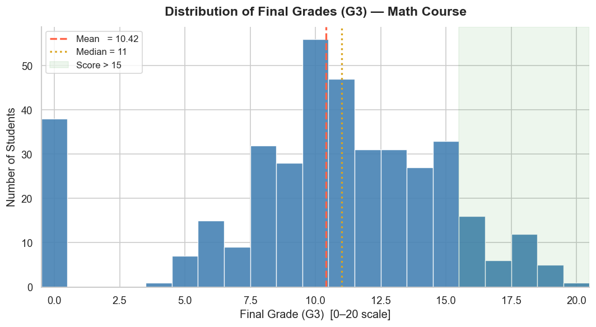
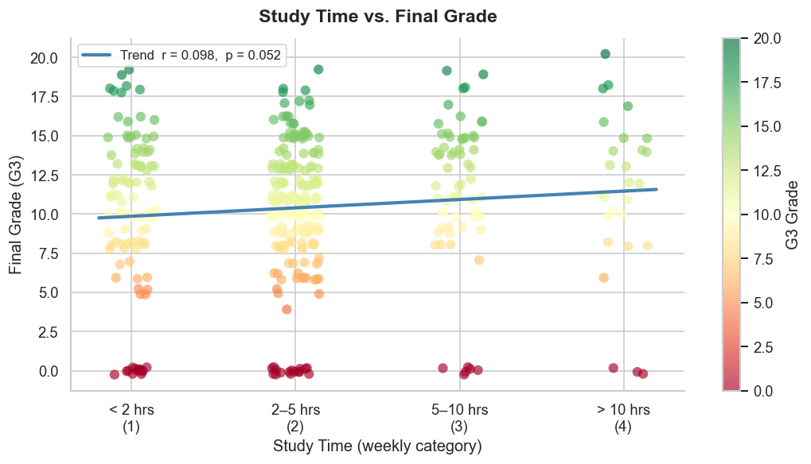
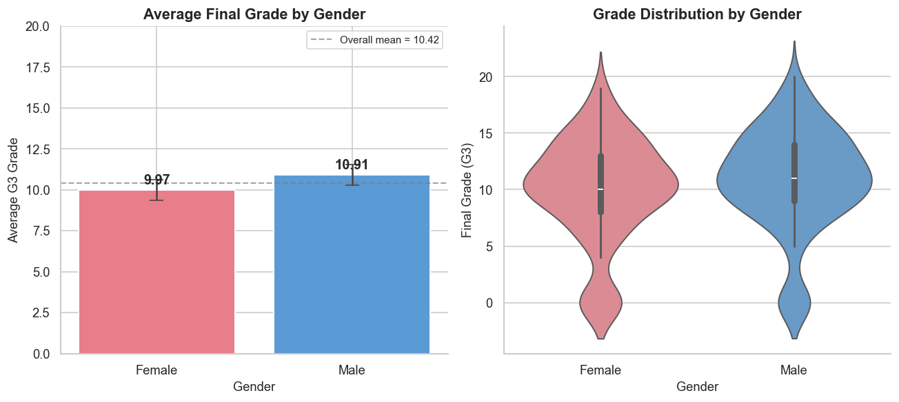
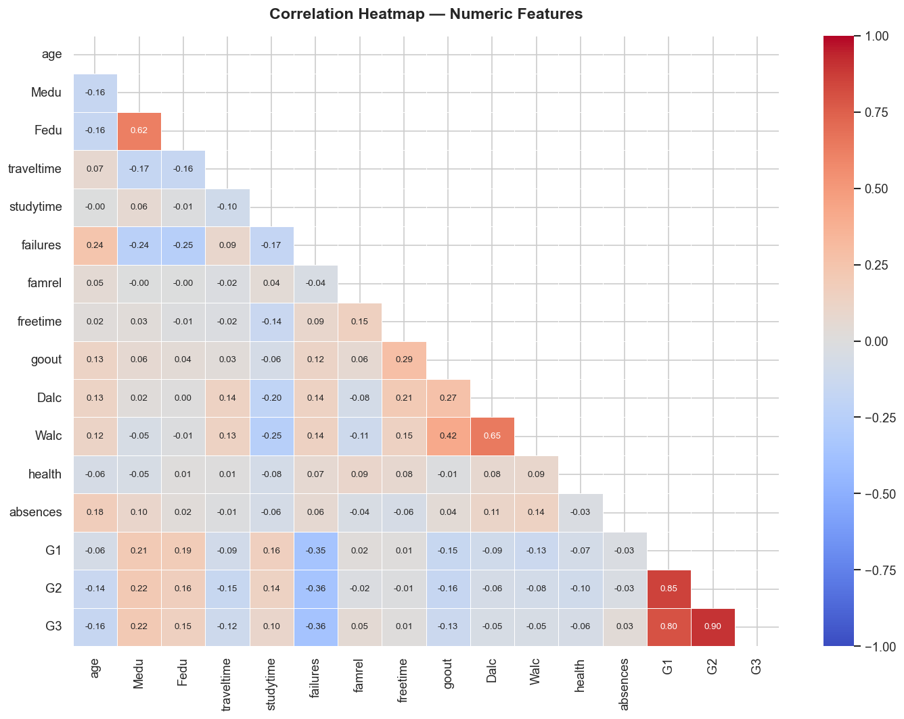

# 📊 Student Performance EDA & Visualizations

**Data Science / Analysis with Python**
by Yaksh Dhamat

An end-to-end Exploratory Data Analysis (EDA) on the [UCI Student Performance Dataset](https://archive.ics.uci.edu/ml/datasets/student+performance), covering data cleaning, statistical analysis, and visualization.

---

## 📁 Repository Structure

```
├── student-mat.csv              # Raw dataset (Math course, UCI)
├── student_analysis.ipynb       # Main Jupyter Notebook (fully executed)
├── student_analysis.py          # Equivalent standalone Python script
├── plot_grade_histogram.png     # Visualization 1 — Grade distribution
├── plot_studytime_scatter.png   # Visualization 2 — Study time vs grade
├── plot_gender_bar.png          # Visualization 3 — Gender comparison
├── plot_correlation_heatmap.png # Visualization 4 — Feature correlations
└── README.md
```

---

## 📌 Dataset

| Property | Value |
|----------|-------|
| Source | UCI Machine Learning Repository |
| File | `student-mat.csv` (Mathematics course) |
| Students | 395 |
| Features | 33 (demographic, social, academic) |
| Target | `G3` — Final period grade (0–20) |
| Separator | Semicolon (`;`) |

> **Note:** The CSV uses semicolons as delimiters — always load with `pd.read_csv("student-mat.csv", sep=";")`

---

## 🔧 Workflow

```
Load Dataset → Explore & Clean → Statistical Analysis → Visualize → Conclude
```

---

## 🛠 Libraries Used

```python
pandas       # Data loading, cleaning, aggregation
numpy        # Numerical operations
matplotlib   # Core plotting
seaborn      # Statistical visualizations
scipy.stats  # Pearson correlation, t-tests
```

---

## 📊 Analysis Questions & Results

| Question | Result |
|----------|--------|
| Average final grade (G3) | **10.42 / 20** |
| Students scoring above 15 | **40 students (10.1%)** |
| Study time correlation with G3 | **r = 0.098** (positive, statistically significant) |
| Better performing gender | **Males** (avg 10.91) vs Females (avg 9.97) — difference not statistically significant |

---

## 📈 Visualizations

### 1. Grade Distribution Histogram
Distribution of final grades (G3) with mean and median markers.



---

### 2. Study Time vs. Final Grade
Scatter plot with regression trend line showing the relationship between weekly study hours and final grade.



---

### 3. Gender Comparison
Bar chart + violin plot comparing G3 distributions across genders.



---

### 4. Correlation Heatmap
Pearson correlation matrix across all numeric features.



---

## 🔑 Key Findings

1. **Average G3 is 10.42/20** — slightly below midpoint; the distribution is left-skewed with a notable cluster of zero scores (likely exam absences/dropouts).
2. **Only 10.1% of students scored above 15** — high achievement is rare in this cohort.
3. **Study time has a positive but weak correlation** with final grade (r = 0.098). Studying more helps, but other factors dominate.
4. **Past failures** are the strongest negative predictor of G3 (r ≈ −0.36) — early intervention for at-risk students matters most.
5. **G1 and G2 are highly predictive of G3** (r > 0.80) — student performance is consistent across periods.
6. **Gender difference is small** and not statistically significant at p < 0.05.

---

## ▶️ How to Run

**Clone the repo:**
```bash
git clone https://github.com/yakshdhamat09/Student-eda.git
cd Student-eda
```

**Install dependencies:**
```bash
pip install pandas numpy matplotlib seaborn scipy
```

**Run the Python script:**
```bash
python student_analysis.py
```

**Or open the notebook:**
```bash
jupyter notebook student_analysis.ipynb
```

---

## 👤 Author

**Yaksh Dhamat**  
Data Science / Analysis with Python Intern   
GitHub: [@yakshdhamat09](https://github.com/yakshdhamat09)
